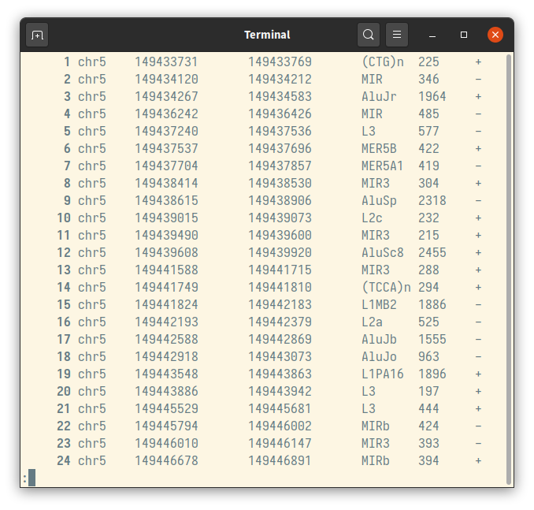
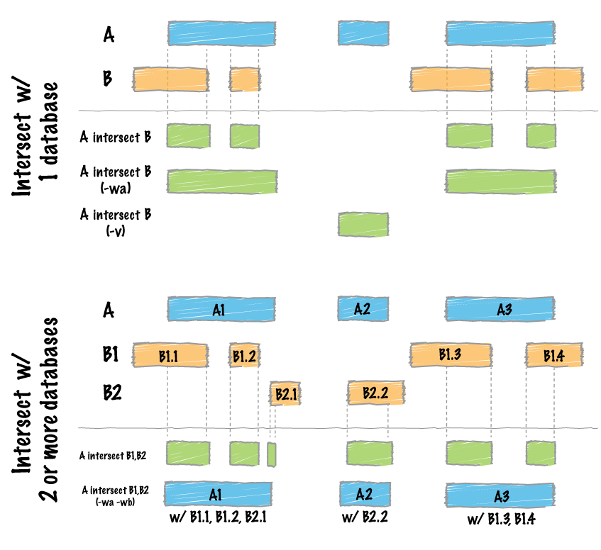
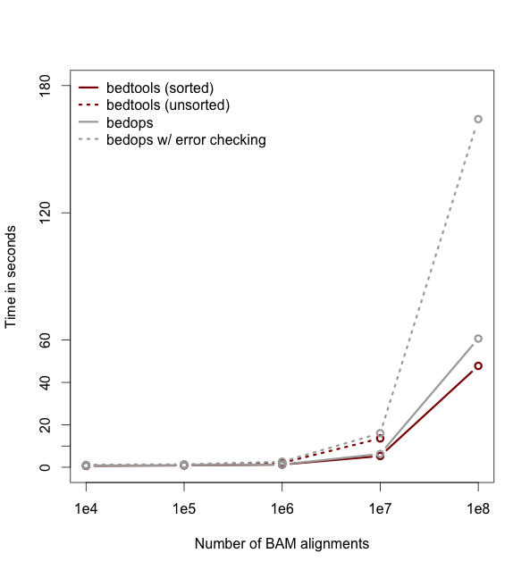
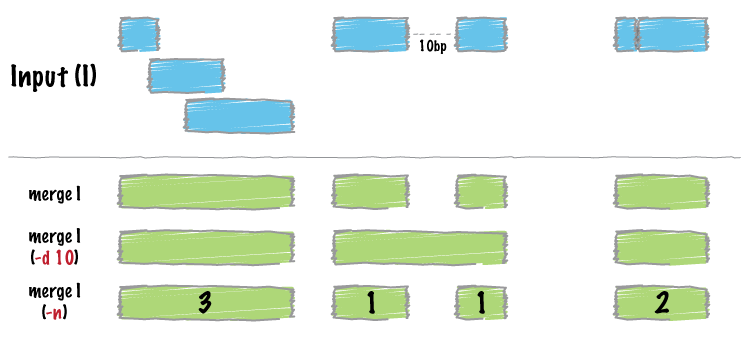
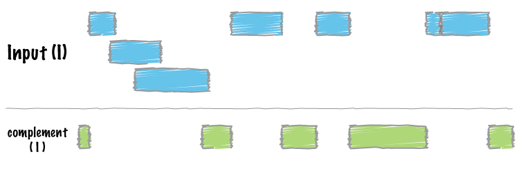
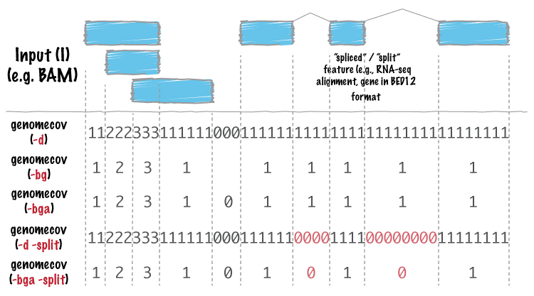

<style>
.small-code pre code {
  font-size: 1 em;
}
.reveal small {
  position: absolute;
  bottom: 0;
  font-size: 50%;
}
.reveal .slides{
    width: 90% !important;  
    height: 90% !important;
}
.reveal p{
  line-height: 1.5 !important;
}
.reveal code{
  background-color: #F8F8F8;
  color: #1E90FF;
}
.reveal code.bad {
  color: #B73239;
  background-color: #F4F4F4;
}
.reveal pre code {
  white-space: pre;
  overflow: auto;
  color: #00008B;
}
</style>

Lecture 5 - MORE Searching NGS File Formats
========================================================
author: Simon Coetzee
date: 03/29/2021
width: 1440
height: 900
transition: fade

<small>This work, "MORE Searching NGS File Formats", is a derivative of part of ["Applied Computational Genomics Course at UU"](https://github.com/quinlan-lab/applied-computational-genomics) by quinlan-lab, and ["bedtools Tutorial"](http://quinlanlab.org/tutorials/bedtools/bedtools.html) by quinlan-lab used under [CC BY-SA](https://creativecommons.org/licenses/by-sa/4.0/). "MORE Searching NGS File Formats" is licensed under [CC BY-SA](https://creativecommons.org/licenses/by-sa/4.0/) by Simon Coetzee.</small>

First - errata for homework 2
========================================================
type: alert

We don't have curl installed on the docker containers. So question #4 forwards 
needs a workaround.

`curl` - cURL is a computer software project providing a library (libcurl) and command-line tool (curl) for transferring data using various network protocols. The name stands for "Client URL".

Instead we will use `wget`

Wget is a computer program that retrieves content from web servers. It is part of the GNU Project. Its name derives from "World Wide Web" and "get." It supports downloading via HTTP, HTTPS, and FTP. 

the curl command in the homework will be replaced by

```bad
wget -O human.genes.gtf.gz \
ftp://ftp.ensembl.org/pub/release-87/gtf/homo_sapiens/Homo_sapiens.GRCh38.87.gtf.gz
```

Goals (awk and bedtools)
========================================================

- Search for and manipulate characters or patterns in a column specific manner using awk.

Goals (awk and bedtools)
========================================================

- Search for characters or patterns in a column specific manner using awk.

- Learn to use bedtools to accomplish genome arithmetic.


AWK
========================================================

AWK is a programming language that is specifically designed for quickly manipulating space delimited data.
The name AWK comes from the initials of the inventors of the languguage at ATT Bell Labs: Alfred ***A***ho, Peter ***W***einberger, and Brian ***K***ernighan

An `awk` program tends to have the structure of

```
condition { action }
condition { action }
...
```
We will only be dealing with simple conditions here though.

AWK
========================================================
## Our example file - BED
`cpg.bed`

 - Chromosome Name
 - Chromosome Start
 - Chromosome End
 
Optional Fields:

Name, Score, Strand, thickStart, thickEnd, itemRgb, blockCount, blockSizes, blockStarts

___

<center>

</center>

AWK
========================================================
## Our example file - BED
`cpg.bed`

```
$ head cpg.bed
chr1    28735   29810   CpG:_116
chr1    135124  135563  CpG:_30
chr1    327790  328229  CpG:_29
chr1    437151  438164  CpG:_84
chr1    449273  450544  CpG:_99
chr1    533219  534114  CpG:_94
chr1    544738  546649  CpG:_171
chr1    713984  714547  CpG:_60
chr1    762416  763445  CpG:_115
chr1    788863  789211  CpG:_28
$ █ 
```

AWK
========================================================

`condition { action }`

The default action in awk is to print the line, so we take advantage of that frequently for filtering a big file.


```bad
columns are identifed by number
      ↓
```
```
awk '$1 == "chr1"' cpg.bed
```

```bad
    ↑            ↑
    single quotes indicate the start and end of the program.
```

Here we are only printing records from `cpg.bed` that are for chr1


AWK can find lines that match your criteria
========================================================

In this case we are searching for lines where the end coordinate is less than the start coordinate.

```
$ awk '$3 < $2' cpg.bed
$ 
```
This returns no lines on a well formed bed file, because the start should come before the end.


AWK knows about line numbers too
========================================================

`NR` is a special variable in awk that stands for record number.

```
$ awk 'NR == 100' cpg.bed
chr1    1417285 1417753 CpG:_42
$ █
```

The above command prints the 100th line in the file.

AWK knows about line numbers too
========================================================

It's possible to have multiple conditions at once too!
in awk, like many languages, the logical AND operator is `&&`

Here we return lines 100 - 200

```
$ awk 'NR >= 100 && NR <= 200' cpg.bed
chr1    1417285 1417753 CpG:_42
chr1    1420226 1420684 CpG:_34
chr1    1444588 1444849 CpG:_19
chr1    1446878 1448205 CpG:_151
chr1    1452701 1453199 CpG:_40
chr1    1455302 1455892 CpG:_48
chr1    1456829 1457074 CpG:_18
chr1    1457954 1459029 CpG:_77
...
```

AWK knows about line numbers too
========================================================

Going further we can add in a logical `OR` operator and group the sub-statements too

```
$ awk '(NR >= 100 && NR <= 200) || ($1 == "chr18)'
chr1    1417285 1417753 CpG:_42
chr1    1420226 1420684 CpG:_34
chr1    1444588 1444849 CpG:_19
chr1    1446878 1448205 CpG:_151
chr1    1452701 1453199 CpG:_40
chr1    1455302 1455892 CpG:_48
chr1    1456829 1457074 CpG:_18
chr1    1457954 1459029 CpG:_77
...
```

The {action} side of AWK
========================================================
`condition { action }`

Rather than just manipulating the condition in which to print lines, we can also
manipulate the output.

We are using the action between curly braces to print the BED record and the length of that interval


```bad
$0 indicates to print the whole line
               ↓
```
```
$ awk '{print $0, $3-$2}' cpg.bed
chr1    28735   29810   CpG:_116 1075
chr1    135124  135563  CpG:_30 439
chr1    327790  328229  CpG:_29 439
...
```

Column separators in AWK
========================================================

By default awk uses a space to separate columns. Most genomics tasks prefer tabs, and keeping them all consistent is better than mixing them.

This also introduces another special variable for AWK, `OFS` which is the Output field separator.

```
$ awk -vOFS='\t' '{print $0, $3-$2}' cpg.bed
chr1    28735   29810   CpG:_116        1075
chr1    135124  135563  CpG:_30 439
chr1    327790  328229  CpG:_29 439
...
```

Column separators in AWK
========================================================

When one sets the `OFS` variable, it only changes for rows that are altered. The annoying sideffect of this is that a command like.
```
awk -vOFS='\t' '{print $0}'
```
does not change the delimiters between all columns in the file like you might expect - since nothing is being changed.


A quick trick to change all the column delimiters at once, is just to reassign a column to itself.
```
awk -vOFS='\t' '$1=$1'
```
This alters every row, and replaces all the column delimiters with tabs

Using AWK as an improved cut command
========================================================

We can use awk to print columns in any order, whereas `cut` prints them only in the original order.

```
$ cut -f4,1 cpg.bed
chr1    CpG:_116
chr1    CpG:_30
chr1    CpG:_29
...
```

With awk we print in arbitrary order, depending on how we list the columns in the print statement.
```
$ awk -vOFS='\t' '{print $4, $1}'
CpG:_116        chr1
CpG:_30 chr1
CpG:_29 chr1
...
```

How many columns on each line?
========================================================

One more helpful built in variable we have in awk is `NF`. This represents the number of fields/columns are detected for each line. By default, these are just white-space delimited.

```
$ awk '{print NF}' cpg.bed
4
4
4
...
```

Assigning variables with AWK
========================================================

Sometimes when ones computation get's a little more complex, its nice to be able to assign your own variables, and not just use the ones built into awk.


This is a simple example that still just prints the length of the element after printing the line.


```bad
len is a variable that is assigned the output of $3-$2
                    ↓
```
```
$ awk -vOFS='\t' '{len=($3-$2); print $0, len}' cpg.bed
chr1    28735   29810   CpG:_116        1075
chr1    135124  135563  CpG:_30 439
chr1    327790  328229  CpG:_29 439
```

Computing across a whole file
========================================================

We can compute the total number of base pairs represented by the CpG islands in two parts.

```
$ awk '{tot_len += $3-$2}END{print tot_len}' cpg.bed
21842742
$ █
```

First, we start with a variable `tot_len` that starts at 0 but increases by the length of each CpG island as awk proceeds down the file.

We then have an `END` statement that indicates that that the following part occurs after all the line by line processing is finished.

Second, we print the contents the `tot_len` variable

Computing across a whole file
========================================================

We can use one of the built in variables in our calculation too.

Here we calculate the average number of base pairs represented by a CpG island.

```
$ awk '{tot_len += $3-$2}END{print tot_len/NR}' cpg.bed
761.31
$ █
```

Computing across a whole file
========================================================

We can even - using [arrays in AWK](https://www.gnu.org/software/gawk/manual/html_node/Arrays.html) - 
compute something per unique value in a column.

Here we calculate the number of base pairs per chromatin annotation across the file.
This is advanced usage, but can be useful to add to ones toolbox.


```bad
array called "a" indexed by the values in column 4
      ↓        
```
```
awk '{a[$4] += ($3-$2)} END {for (i in a) print i, a[i]}' hesc.chromHmm.bed | sort -k2,2nr
```

```bad
                  ↑
we increment the value for each index by the length of each element of that index
```

Computing across a whole file
========================================================

We can even - using [arrays in AWK](https://www.gnu.org/software/gawk/manual/html_node/Arrays.html) - 
compute something per unique value in a column.

Here we calculate the number of base pairs per chromatin annotation across the file.
This is advanced usage, but can be useful to add to ones toolbox.

```
$ awk '{a[$4] += ($3-$2)} END {for (i in a) print i, a[i]}' hesc.chromHmm.bed | sort -k2,2nr
13_Heterochrom/lo 1992618522
11_Weak_Txn 503587684
10_Txn_Elongation 82134508
7_Weak_Enhancer 66789380
12_Repressed 38190271
6_Weak_Enhancer 35705628
9_Txn_Transition 25674539
8_Insulator 22467670
2_Weak_Promoter 18737021
3_Poised_Promoter 18724570
1_Active_Promoter 9908594
5_Strong_Enhancer 7139201
14_Repetitive/CNV 4079101
4_Strong_Enhancer 2648615
15_Repetitive/CNV 2342560
$ █
```

Genome Arithmetic with bedtools
========================================================
type: sub-section

<center>

</center>

bedtools allows one to intersect, merge, count, complement, and shuffle genomic intervals from multiple files in widely-used genomic file formats such as BAM, BED, GFF/GTF, VCF.

Genome Arithmetic with bedtools
========================================================

bedtools is a command line tool with many subcommands to perform specific tasks.
```
bedtools is a powerful toolset for genome arithmetic.

Version:   v2.30.0
About:     developed in the quinlanlab.org and by many contributors worldwide.
Docs:      http://bedtools.readthedocs.io/
Code:      https://github.com/arq5x/bedtools2
Mail:      https://groups.google.com/forum/#!forum/bedtools-discuss

Usage:     bedtools <subcommand> [options]

The bedtools sub-commands include:
```
Genome Arithmetic with bedtools
========================================================

bedtools is a command line tool with many subcommands to perform specific tasks.
```
[ Genome arithmetic ]
    intersect     Find overlapping intervals in various ways.
    window        Find overlapping intervals within a window around an interval.
    closest       Find the closest, potentially non-overlapping interval.
    coverage      Compute the coverage over defined intervals.
    map           Apply a function to a column for each overlapping interval.
    genomecov     Compute the coverage over an entire genome.
    merge         Combine overlapping/nearby intervals into a single interval.
    cluster       Cluster (but don't merge) overlapping/nearby intervals.
    complement    Extract intervals _not_ represented by an interval file.
    shift         Adjust the position of intervals.
    subtract      Remove intervals based on overlaps b/w two files.
    slop          Adjust the size of intervals.
    flank         Create new intervals from the flanks of existing intervals.
    sort          Order the intervals in a file.
    random        Generate random intervals in a genome.
    shuffle       Randomly redistribute intervals in a genome.
    sample        Sample random records from file using reservoir sampling.
    spacing       Report the gap lengths between intervals in a file.
    annotate      Annotate coverage of features from multiple files.
```

Genome Arithmetic with bedtools
========================================================

bedtools is a command line tool with many subcommands to perform specific tasks.

each tool is called in the form `bedtools <subcommand>` as follows:
```
$ bedtools intersect

Tool:    bedtools intersect (aka intersectBed)
Version: v2.30.0
Summary: Report overlaps between two feature files.

Usage:   bedtools intersect [OPTIONS] -a <bed/gff/vcf/bam> -b <bed/gff/vcf/bam>

	Note: -b may be followed with multiple databases and/or
	wildcard (*) character(s).
Options:
	-wa	Write the original entry in A for each overlap.

	-wb	Write the original entry in B for each overlap.
		- Useful for knowing _what_ A overlaps. Restricted by -f and -r.
...		
```

Some example files
========================================================
type: sub-section

- `cpg.bed` - represents CpG islands in the human genome
- `exons.bed` - represents RefSeq exons from human genes
- `gwas.bed` - represents human disease-associated SNPs that were identified in genome-wide association studies
- `hesc.chromHmm.bed` - represents the predicted function (by chromHMM) of each interval in the genome of a human embryonic stem cell based upon ChIP-seq experiments from ENCODE

I'll take a look at these quickly in IGV^1 - an easy to use local genome browser

<small>
1. https://software.broadinstitute.org/software/igv/
</small>

bedtools - intersect
========================================================

This is probably the command you will use the most often.

It compares 2 or more bed files (or bam, or vcf, or gtf) and identifies all the
regions in the genome where the features overlap.

Want to know where one feature lies relative to another, this is your tool.

bedtools - intersect
========================================================

It compares 2 or more bed files (or bam, or vcf, or gtf) and identifies all the
regions in the genome where the features overlap.

<center>

</center>

bedtools - intersect
========================================================
### Default behavior
By default, intersect reports the intervals that represent overlaps between your
two files. To demonstrate, let’s identify all of the CpG islands that overlap exons.

**these are not the original cpg intervals, *only the portion that overlaps* with the exons**
```
$ bedtools intersect -a cpg.bed -b exons.bed | head -5
chr1    29320   29370   CpG:_116
chr1    135124  135563  CpG:_30
chr1    327790  328229  CpG:_29
chr1    327790  328229  CpG:_29
chr1    327790  328229  CpG:_29
$ █
```

bedtools - intersect
========================================================
### Report the original interval in each file.

The `-wa` (write A) and `-wb` (write B) options allow one to see the original 
records from the A and B files that overlapped. As such, instead of not only 
showing you where the intersections occurred, it shows you what intersected.

```
bedtools intersect -a cpg.bed -b exons.bed -wa -wb | head -5
chr1    28735   29810   CpG:_116    chr1    29320   29370   NR_024540_exon_10_0_chr1_29321_r        -
chr1    135124  135563  CpG:_30 chr1    134772  139696  NR_039983_exon_0_0_chr1_134773_r    0   -
chr1    327790  328229  CpG:_29 chr1    324438  328581  NR_028322_exon_2_0_chr1_324439_f    0   +
chr1    327790  328229  CpG:_29 chr1    324438  328581  NR_028325_exon_2_0_chr1_324439_f    0   +
chr1    327790  328229  CpG:_29 chr1    327035  328581  NR_028327_exon_3_0_chr1_327036_f    0   +
$ █
```

bedtools - intersect
========================================================
### How many base pairs of overlap were there?

The `-wo` (write overlap) option allows one to also report the number of base 
pairs of overlap between the features that overlap between each of the files.

```
$ bedtools intersect -a cpg.bed -b exons.bed -wo | head -5
chr1    28735   29810   CpG:_116    chr1    29320   29370   NR_024540_exon_10_0_chr1_29321_r        -   50
chr1    135124  135563  CpG:_30 chr1    134772  139696  NR_039983_exon_0_0_chr1_134773_r    0       439
chr1    327790  328229  CpG:_29 chr1    324438  328581  NR_028322_exon_2_0_chr1_324439_f    0       439
chr1    327790  328229  CpG:_29 chr1    324438  328581  NR_028325_exon_2_0_chr1_324439_f    0       439
chr1    327790  328229  CpG:_29 chr1    327035  328581  NR_028327_exon_3_0_chr1_327036_f    0       439
$ █
```

bedtools - intersect
========================================================
### Counting the number of overlapping features.

We can also count, for each feature in the “A” file, the number of overlapping 
features in the “B” file. This is handled with the `-c` option.

```
$ bedtools intersect -a cpg.bed -b exons.bed -c | head -5
chr1    28735   29810   CpG:_116    1
chr1    135124  135563  CpG:_30 1
chr1    327790  328229  CpG:_29 3
chr1    437151  438164  CpG:_84 0
chr1    449273  450544  CpG:_99 0
$ █
```

bedtools - intersect
========================================================
### Find features that DO NOT overlap
remember `grep -v` ?!

Often we want to identify those features in our A file that do not overlap features in the B file.

```
$ bedtools intersect -a cpg.bed -b exons.bed -v | head -5
chr1    437151  438164  CpG:_84
chr1    449273  450544  CpG:_99
chr1    533219  534114  CpG:_94
chr1    544738  546649  CpG:_171
chr1    801975  802338  CpG:_24
$ █
```

bedtools - intersect
========================================================
### Require a minimal fraction of overlap.

Recall that the default is to report overlaps between features in A and B so 
long as at least one base pair of overlap exists. However, the `-f` option 
allows you to specify what fraction of each feature in A should be overlapped by
a feature in B before it is reported.

Let’s be more strict and require 50% of overlap.

```
$ bedtools intersect -a cpg.bed -b exons.bed -wo -f 0.50 | head -5
chr1    135124  135563  CpG:_30 chr1    134772  139696  NR_039983_exon_0_0_chr1_134773_r    0       439
chr1    327790  328229  CpG:_29 chr1    324438  328581  NR_028322_exon_2_0_chr1_324439_f    0       439
chr1    327790  328229  CpG:_29 chr1    324438  328581  NR_028325_exon_2_0_chr1_324439_f    0       439
chr1    327790  328229  CpG:_29 chr1    327035  328581  NR_028327_exon_3_0_chr1_327036_f    0       439
chr1    788863  789211  CpG:_28 chr1    788770  794826  NR_047519_exon_5_0_chr1_788771_f    0       348
$ █
```

bedtools - intersect
========================================================
### Bedtools is faster when your files are sorted.

We can sort with the tools we already know (these files are all pre-sorted already)
```
$ sort -k1,1V -k2,2n gwas.bed > gwas.sorted.bed
$ █
```
<center>

</center>

bedtools - intersect
========================================================
### Intersecting multiple files at once
bedtools is able to intersect an “A” file against one or more “B” files. This 
greatly simplifies analyses involving multiple datasets relevant to a given
experiment. For example, let’s intersect exons with CpG islands, GWAS SNPs, 
and the ChromHMM annotations.

```
$ bedtools intersect -a exons.bed -b cpg.bed gwas.bed hesc.chromHmm.bed -sorted | head -5
chr1    11873   11937   NR_046018_exon_0_0_chr1_11874_f 0   +
chr1    11937   12137   NR_046018_exon_0_0_chr1_11874_f 0   +
chr1    12137   12227   NR_046018_exon_0_0_chr1_11874_f 0   +
chr1    12612   12721   NR_046018_exon_1_0_chr1_12613_f 0   +
chr1    13220   14137   NR_046018_exon_2_0_chr1_13221_f 0   +
$ █
```

bedtools - intersect
========================================================
Now by default, this isn’t incredibly informative as we can’t tell which of 
the three **“B”** files yielded the intersection with each exon. However, if we use 
the `-wa` and `-wb` options, we can see from which file number (following the order 
of the files given on the command line) the intersection came. In this case, 
the 7th column reflects this file number.

```
bedtools intersect -a exons.bed -b cpg.bed gwas.bed hesc.chromHmm.bed -sorted -wa -wb \
  | head -10000 \
  | tail -5
chr1    27632676    27635124    NM_015023_exon_15_0_chr1_27632677_f 0   +   3   chr1    27635013    27635413    7_Weak_Enhancer
chr1    27648635    27648882    NM_032125_exon_0_0_chr1_27648636_f  0   +   1   chr1    27648453    27649006    CpG:_63
chr1    27648635    27648882    NM_032125_exon_0_0_chr1_27648636_f  0   +   3   chr1    27648613    27649413    1_Active_Promoter
chr1    27648635    27648882    NR_037576_exon_0_0_chr1_27648636_f  0   +   1   chr1    27648453    27649006    CpG:_63
chr1    27648635    27648882    NR_037576_exon_0_0_chr1_27648636_f  0   +   3   chr1    27648613    27649413    1_Active_Promoter
$ █
```

bedtools - intersect
========================================================
Additionally, one can use file “labels” instead of file numbers to facilitate 
interpretation, especially when there are many files involved.

```
$ bedtools intersect -a exons.bed -b cpg.bed gwas.bed hesc.chromHmm.bed -sorted -wa -wb -names cpg gwas chromhmm \
  | head -10000 \
  | tail -5
chr1    27632676    27635124    NM_015023_exon_15_0_chr1_27632677_f 0   +   chromhmm    chr1    27635013    27635413    7_Weak_Enhancer
chr1    27648635    27648882    NM_032125_exon_0_0_chr1_27648636_f  0   +   cpg chr1    27648453    27649006    CpG:_63
chr1    27648635    27648882    NM_032125_exon_0_0_chr1_27648636_f  0   +   chromhmm    chr1    27648613    27649413    1_Active_Promoter
chr1    27648635    27648882    NR_037576_exon_0_0_chr1_27648636_f  0   +   cpg chr1    27648453    27649006    CpG:_63
chr1    27648635    27648882    NR_037576_exon_0_0_chr1_27648636_f  0   +   chromhmm    chr1    27648613    27649413    1_Active_Promoter
$ █
```

bedtools - merge
========================================================
Many datasets of genomic features have many individual features that overlap one 
another (e.g. aligments from a ChiP seq experiment). It is often useful to just 
combine the overlapping into a single, contiguous interval.

<center>

</center>

bedtools - merge
========================================================
### Input must be sorted

The merge tool requires that the input file is sorted by chromosome, then by start position. This allows the merging algorithm to work very quickly without requiring any RAM.

If your files are unsorted, the merge tool will raise an error.

We can use bedtools sort to sort by a specific chromosome order - for example, exactly the one your colleague who aligned your data used with their reference genome.

We'll take a look at genome.txt in a moment.

```
$ bedtools sort -g genome.txt -i exons.bed > exons.sorted.bed
$ █
```

bedtools - merge
========================================================
### Merge intervals.
Merging results in a new set of intervals representing the merged set of 
intervals in the input. That is, if a base pair in the genome is covered by 
ten features, it will now only be represented once in the output file.

```
$ bedtools merge -i exons.bed | head -n 10
chr1    11873   12227
chr1    12612   12721
chr1    13220   14829
chr1    14969   15038
chr1    15795   15947
chr1    16606   16765
chr1    16857   17055
chr1    17232   17368
chr1    17605   17742
chr1    17914   18061
$ █
```

bedtools - merge
========================================================
### Count the number of overlapping intervals.
A more sophisticated approach would be to not only merge overlapping intervals,
but also report the number of intervals that were integrated into the new, 
merged interval.

The `-c` option allows one to specify a column or columns in the input that you wish to summarize

The `-o` option defines the operation(s) that you wish to apply to each column listed for the -c option
```
$ bedtools merge -i exons.bed -c 1 -o count | head -n 10
chr1    11873   12227   1
chr1    12612   12721   1
chr1    13220   14829   2
chr1    14969   15038   1
chr1    15795   15947   1
chr1    16606   16765   1
chr1    16857   17055   1
chr1    17232   17368   1
chr1    17605   17742   1
chr1    17914   18061   1
$ █
```

bedtools - merge
========================================================
### Merge operations
```
-o	Specify the operation that should be applied to -c.
		Valid operations:
		    sum, min, max, absmin, absmax,
		    mean, median, mode, antimode
		    stdev, sstdev
		    collapse (i.e., print a delimited list (duplicates allowed)),
		    distinct (i.e., print a delimited list (NO duplicates allowed)),
		    distinct_sort_num (as distinct, sorted numerically, ascending),
		    distinct_sort_num_desc (as distinct, sorted numerically, desscending),
		    distinct_only (delimited list of only unique values),
		    count
		    count_distinct (i.e., a count of the unique values in the column),
		    first (i.e., just the first value in the column),
		    last (i.e., just the last value in the column),
		Default: sum
		Multiple operations can be specified in a comma-delimited list.
```

bedtools - merge
========================================================
### Merging features that are close to one another.

With the `-d` (distance) option, one can also merge intervals that do not
overlap, yet are close to one another. For example, to merge features that are
no more than 1000bp apart, one would run:

```
$ bedtools merge -i exons.bed -d 1000 -c 1 -o count | head -10
chr1    11873   18366   12
chr1    24737   24891   1
chr1    29320   29370   1
chr1    34610   36081   6
chr1    69090   70008   1
chr1    134772  140566  3
chr1    323891  328581  10
chr1    367658  368597  3
chr1    621095  622034  3
chr1    661138  665731  3
$ █
```

bedtools - merge
========================================================
### Listing the name of each of the exons that were merged.

Many times you want to keep track of the details of exactly which intervals were merged. One way to do this is to create a list of the names of each feature. We can do with with the **collapse** operation available via the `-o` argument.

```
$ bedtools merge -i exons.bed -d 90 -c 1,4 -o count,collapse | head -20
chr1    11873   12227   1   NR_046018_exon_0_0_chr1_11874_f
chr1    12612   12721   1   NR_046018_exon_1_0_chr1_12613_f
chr1    13220   14829   2   NR_046018_exon_2_0_chr1_13221_f,NR_024540_exon_0_0_chr1_14362_r
chr1    14969   15038   1   NR_024540_exon_1_0_chr1_14970_r
chr1    15795   15947   1   NR_024540_exon_2_0_chr1_15796_r
chr1    16606   16765   1   NR_024540_exon_3_0_chr1_16607_r
chr1    16857   17055   1   NR_024540_exon_4_0_chr1_16858_r
chr1    17232   17368   1   NR_024540_exon_5_0_chr1_17233_r
chr1    17605   17742   1   NR_024540_exon_6_0_chr1_17606_r
chr1    17914   18061   1   NR_024540_exon_7_0_chr1_17915_r
$ █
```

bedtools - complement
========================================================
We often want to know which intervals of the genome are NOT “covered” by intervals in a given feature file. For example, if you have a set of ChIP-seq peaks, you may also want to know which regions of the genome are not bound by the factor you assayed.

<center>

</center>

bedtools - complement
========================================================
As an example, let’s find all of the non-exonic (i.e., intronic or intergenic) regions of the genome.

Here we see another use for the `genome.txt` file.
```
$ bedtools complement -i exons.bed -g genome.txt > non-exonic.bed
$ head non-exonic.bed
chr1    0   11873
chr1    12227   12612
chr1    12721   13220
chr1    14829   14969
chr1    15038   15795
chr1    15947   16606
chr1    16765   16857
chr1    17055   17232
chr1    17368   17605
chr1    17742   17914
$ █
```

bedtools - genomecov
========================================================
For many analyses, one wants to measure the genome wide coverage of a feature file. For example, we often want to know what fraction of the genome is covered by 1 feature, 2 features, 3 features, etc. This is frequently crucial when assessing the “uniformity” of coverage from whole-genome sequencing.

<center>

</center>

bedtools - genomecov
========================================================
As an example, let’s produce a histogram of coverage of the exons throughout the genome.

* chromosome (or entire genome)
* depth of coverage from features in input file
* number of bases on chromosome (or genome) with depth equal to column 2.
* size of chromosome (or entire genome) in base pairs
* fraction of bases on chromosome (or entire genome) with depth equal to column 2.

```
$ bedtools genomecov -i exons.bed -g genome.txt > exon.histogram
$ less exon.histogram
chr1	0	241996316	249250621	0.970896
chr1	1	4276763	249250621	0.0171585
chr1	2	1475526	249250621	0.00591985
chr1	3	710135	249250621	0.00284908
chr1	4	388193	249250621	0.00155744
chr1	5	179651	249250621	0.000720765
chr1	6	91005	249250621	0.000365114
...
```

bedtools - genomecov
========================================================
### Producing BEDGRAPH output

bedgraph^1 is a format we didn't talk about, it allows display of continuous-valued data in track format. This display type is useful for probability scores, transcriptome data, and coverage! Using the `-bg` option, one can also produce this output which represents the “depth” of feature coverage for each base pair in the genome.

```
$ bedtools genomecov -i exons.bed -g genome.txt -bg | head -10
chr1    11873   12227   1
chr1    12612   12721   1
chr1    13220   14361   1
chr1    14361   14409   2
chr1    14409   14829   1
chr1    14969   15038   1
chr1    15795   15947   1
chr1    16606   16765   1
chr1    16857   17055   1
chr1    17232   17368   1
$ █
```

<small>
1. https://genome.ucsc.edu/goldenPath/help/bedgraph.html
</small>

bedtools - a practical example:
========================================================

Let’s imagine you have a BED file of ChiP-seq peaks from two different experiments. You want to identify peaks that were observed in both experiments (requiring 50% reciprocal overlap) and for those peaks, you want to find to find the closest, non-overlapping gene. Such an analysis could be conducted with two, relatively simple bedtools commands.

intersect the peaks from both experiments.
`-f` 0.50 combined with `-r` requires 50% reciprocal overlap between the
peaks from each experiment.
```
$ bedtools intersect -a exp1.bed -b exp2.bed -f 0.50 -r > both.bed
```

find the closest, non-overlapping gene for each interval where
both experiments had a peak
`-io` ignores overlapping intervals and returns only the closest,
non-overlapping interval (in this case, genes)
```
$ bedtools closest -a both.bed -b genes.bed -io > both.nearest.genes.txt
```
